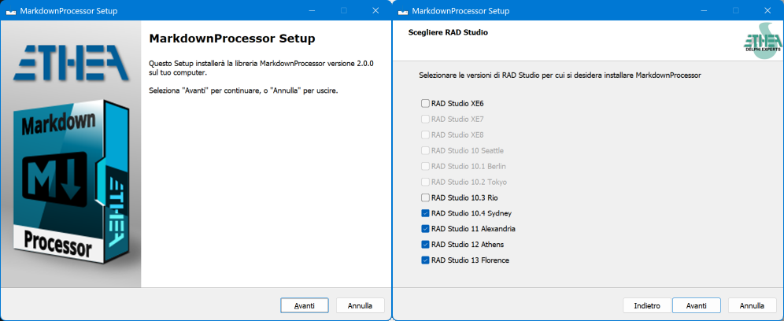
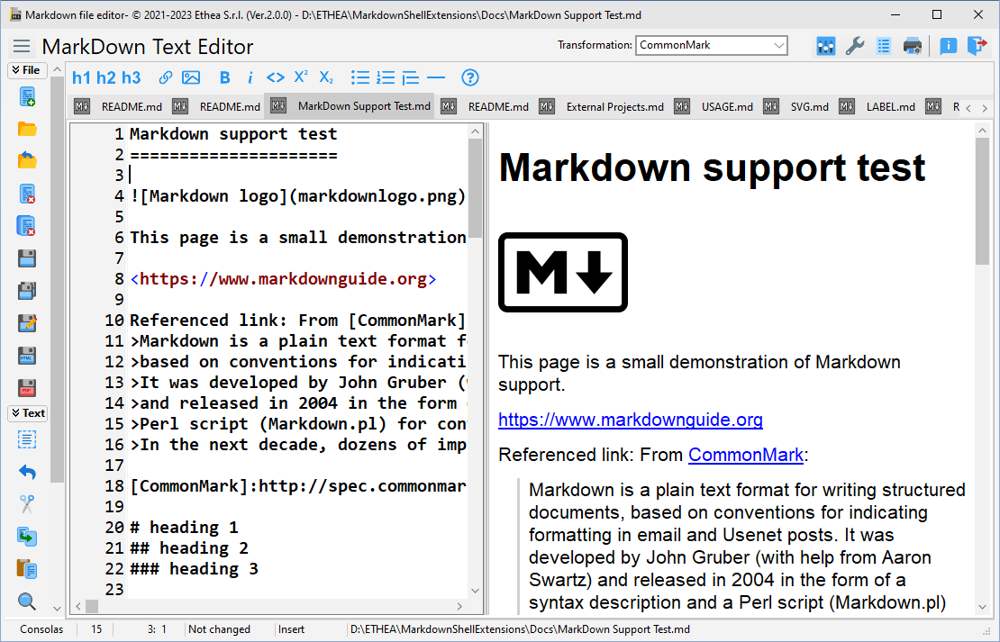
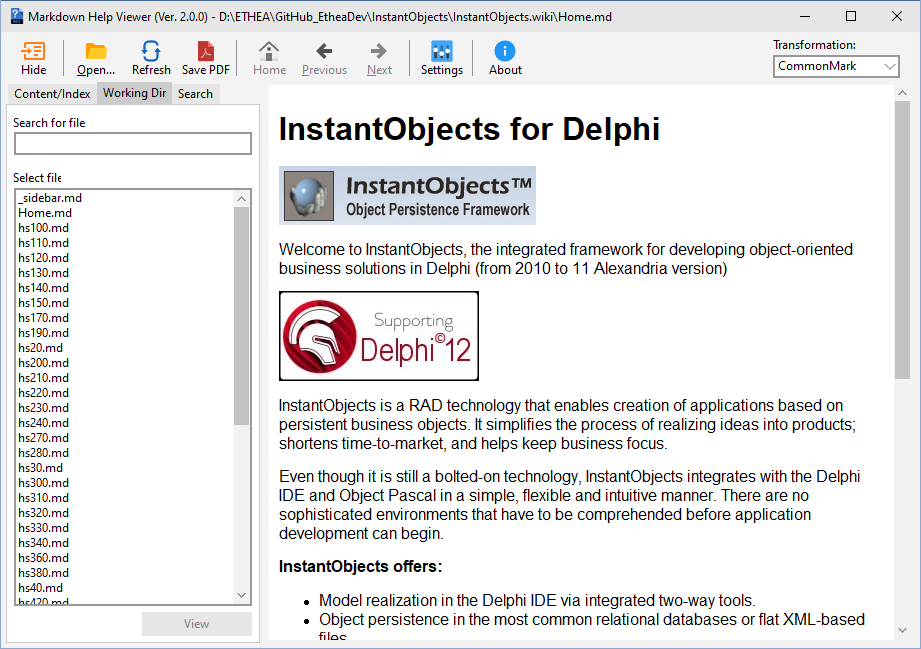
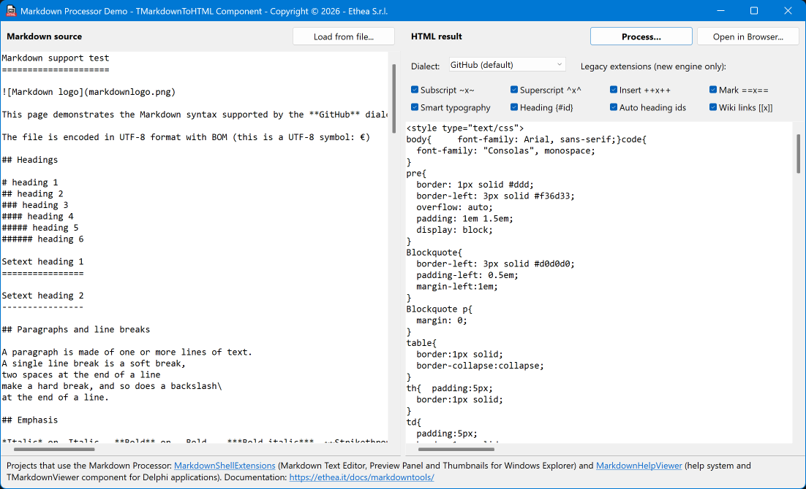

# Markdown Processor for Delphi (Lib, Component, MarkDownToHTML.exe cmd).

A Markdown Processor Library for Delphi, to process/convert markdown files to HTML.

A Useful utility: **MarkDownToHTML.exe** to transform any markdown file to HTML

<!-- badges -->
[](LICENSE)
[](https://github.com/EtheaDev/MarkdownProcessor/releases)
[](https://www.embarcadero.com/products/delphi)
[](https://docwiki.embarcadero.com/RADStudio/en/Main_Page)
[](https://spec.commonmark.org/0.31.2/)
[](https://github.github.com/gfm/)
[](https://katex.org/)
[](https://docs.github.com/en/get-started/writing-on-github/getting-started-with-writing-and-formatting-on-github/basic-writing-and-formatting-syntax#alerts)
[](Tests/CONFORMANCE.md)


[www.embarcadero.com](https://www.embarcadero.com/) - [learndelphi.org](https://learndelphi.org/)

A Pascal (Delphi) library that processes markdown text/files to HTML.

## Documentation

Follow the [Project Site](https://ethea.it/docs/markdowntools/) to know all the markdown tools and the Delphi components: Markdown Processor, Markdown Text Editor and Markdown Help Viewer.

---

## Setup for automatic installation of the Library/Component and Utilities

A ready-to-use "Installer" is located in the Release area: [Download the Installer](https://github.com/EtheaDev/MarkdownProcessor/releases/latest/download/MarkdownProcessor_Setup.exe).

The Installer automatically detects your Delphi versions (from XE6 to 13 Florence), installs the sources, builds and installs the packages with the TMarkdownToHTML component and adds the source paths. It also installs the **MarkDownToHTML.exe** utility, 32 or 64 bit.



To install manually, open `Packages\<Delphi version>\MarkdownProcessor.groupproj`, build the runtime (`MarkdownProcessor`) and install the design-time (`dclMarkdownProcessor`) packages, or run `Packages\BuildAllPackages<Delphi version>.ps1` (for example `BuildAllPackagesD13.ps1`).

---

## Using the MarkDownToHTML.exe utility

With MarkDownToHTML.exe you can transform a markdown file to HTML using different markdown dialects or StyleSheet.

run **MarkDownToHTML.exe help processfile** for a complete help.

Look into Cmd\MarkdownToHTML\Test\MarkDownToHTML_Test.cmd for examples

---

## Basic Informations for Delphi users

This is a Pascal (Delphi) library that processes markdown to HTML. At present the following dialects of markdown are supported:

* **GitHub** (`mdGitHub`, the **default** dialect): what github.com renders, GFM plus math, alerts, mermaid and graph diagrams.

* **GitHub Flavored Markdown 0.29** (`mdGFM`): CommonMark plus tables, task
 list items, strikethrough, extended autolinks and disallowed raw HTML, all the 24 examples of the specification pass (see <https://github.github.com/gfm/>)

* **CommonMark 0.31.2** (`mdCommonMark`): complete support, all the 652 examples of the specification pass (see <https://spec.commonmark.org/0.31.2/>)

* The Daring Fireball dialect (`mdDaringFireball`)
 (see <https://daringfireball.net/projects/markdown/>)

* Enhanced TxtMark dialect (`mdTxtMark`)
 (translated from <https://github.com/rjeschke/txtmark>)

`mdGitHub`, `mdCommonMark` and `mdGFM` run on a new engine available from 2.0 version (block parser, inline parser and HTML renderer written after the parsing strategy of the CommonMark
specification) that can also return a read-only syntax tree.

`mdDaringFireball` and `mdTxtMark` keep the original engine, unchanged.

Optional syntax of the new engine, enabled one by one with `Config.Extensions` (`mdGitHub` enables GFM + math + alerts + mermaid, `mdGFM` the five GFM extensions, `mdCommonMark` none):

| Extension | Syntax |
|---|---|
| `mexTables`, `mexTaskLists`, `mexStrikethrough`, `mexAutolinks`, `mexTagFilter` | GFM extensions |
| `mexMath` | `$x$`, `$$x$$`, `$$` blocks, ```` ```math ```` (KaTeX/MathJax ready HTML) |
| `mexAlerts` | GitHub alerts: `> [!NOTE]`, `[!TIP]`, `[!IMPORTANT]`, `[!WARNING]`, `[!CAUTION]` |
| `mexSubscript`, `mexSuperscript`, `mexInsert`, `mexMark` | `~x~`, `^x^`, `++x++`, `==x==` |
| `mexSmartTypography` | `--` `---` `...` `(C)` `(R)` `(TM)` `<<` `>>` and curly quotes |
| `mexHeadingAttributes`, `mexAutoHeadingIds` | `# Title {#id}`, GitHub-style heading ids |
| `mexWikiLinks` | `[[...]]`, rendered by `Config.specialLinkEmitter` |
| `mexMermaid` | ```` ```mermaid ```` written as `<pre class="mermaid">` for mermaid.js |

Math is written for KaTeX/MathJax by default; for a viewer without JavaScript (such as HTMLViewer) set `Config.MathRendering := mmrCodeCogsImage` to get `` from latex.codecogs.com. Mermaid diagrams need mermaid.js in the page (e.g. WebView2); elsewhere the `<pre>` shows their source.

Upgrading from a previous 1.x version: read [docs/MIGRATION.md](docs/MIGRATION.md).

## The TMarkdownToHTML component

| Component | Description |
| :---: | --- |
| <br>**TMarkdownToHTML** | Non-visual component (unit `MarkdownProcessorComponents.pas`, palette page *Markdown*) that holds the options of the processor (`ProcessorDialect`, `Extensions`, `AllowUnsafe`, `MathRendering`, `CssStyle`) and converts `MarkdownContent` into `HtmlContent` every time the content or an option changes. By default it uses the GitHub dialect and enables all the legacy extensions (subscript, superscript, insert, mark, smart typography, heading ids, wiki links). |

Properties, methods and examples: [TMarkdownToHTML Component](https://ethea.it/docs/markdowntools/MarkdownProcessor/TMarkdownToHTML-Component).

### Using the Library with Delphi

The library can be used in two ways:

- with the **TMarkdownToHTML component** (unit `MarkdownProcessorComponents.pas`): drop it on a form, set its options in the Object Inspector and read the HTML; the conversion is repeated automatically when the content or an option changes;
- with the **TMarkdownProcessor class** (unit `MarkdownProcessor.pas`): create the processor of the dialect you want, configure it and call `Process`.

With the component:

```Pascal
MarkdownToHTML.MarkdownContent.Text := MarkdownText;
LHTMLText := MarkdownToHTML.HtmlContent.Text;
```

With the class:

```Pascal
md := TMarkdownProcessor.CreateDialect;   // mdGitHub, or pass the dialect
try
  md.Config.Extensions := md.Config.Extensions + [mexMark];  // optional syntax
  LHTMLText := md.Process(markdown);           // an HTML fragment, not a full page
finally
  md.Free;
end;
```

Safe mode is the default (`AllowUnsafe = False`): set it to `True` only with trusted content.

The complete guide (dialects, extensions, math and mermaid, syntax tree, hooks, safe mode) is in the online documentation:
[Markdown Processor](https://ethea.it/docs/markdowntools/MarkdownProcessor/Markdown-Processor) and [TMarkdownToHTML Component](https://ethea.it/docs/markdowntools/MarkdownProcessor/TMarkdownToHTML-Component).

### Conformance tests

The DUnitX test project (Delphi 13, Win32 and Win64) is in the `Tests` folder:
run `Tests\RunTests.cmd`. It checks the official CommonMark and GFM examples,
the math, alerts, extensions and safe mode corpora, pathological inputs, and
that the output of the legacy dialects does not change. The results are in
[Tests/CONFORMANCE.md](Tests/CONFORMANCE.md).

## Delphi projects Examples

This library is used in two projects:

- [MarkdownShellExtensions](https://github.com/EtheaDev/MarkdownShellExtensions)

A collection of tools for markdown files, to edit and view content, with an advanced Editor:



- [MarkdownHelpViewer](https://github.com/EtheaDev/MarkdownHelpViewer)

An integrated help system based on files in Markdown format (and also html), for Delphi applications:



## Demo

The VCL demo in `Demo\MarkdownProcessorDemo` converts the sample document `TestFile\MarkDown Support Test.md` (or any Markdown file) with the component: you can change the dialect and the legacy extensions and open the result in the browser, with math formulas and mermaid diagrams.



More details: [Markdown Processor Demo](https://ethea.it/docs/markdowntools/MarkdownProcessor/TMarkdownToHTML-Demo). Complete documentation of the library: [Markdown Processor](https://ethea.it/docs/markdowntools/MarkdownProcessor/Markdown-Processor).

## Release Notes ##

08 Oct 2026: ver. 2.0.0 (major version: new CommonMark/GFM engine)
- New engine (block parser, inline parser, HTML renderer) written after the parsing strategy of the CommonMark specification, still compatible from Delphi XE3
- `mdCommonMark` now runs on the new engine: CommonMark 0.31.2, all the 652 examples of the specification pass
- New dialect `mdGFM`: GitHub Flavored Markdown 0.29 (tables, task lists, strikethrough, extended autolinks, disallowed raw HTML), all the 24 examples pass
- New dialect `mdGitHub`, the new **default** (`DefaultMarkdownDialect`, `CreateDialect` without arguments): GFM + math + GitHub alerts + mermaid, as github.com
- `mdDaringFireball` and `mdTxtMark` keep the original engine with exactly the same output (checked by snapshot tests); the new dialects are appended to `TMarkdownProcessorDialect`, existing ordinals unchanged
- Optional syntax as individual flags (`Config.Extensions`): math, GitHub alerts, mermaid, subscript, superscript, insert, mark, smart typography, `{#id}` heading attributes, GitHub-style heading ids, wiki links
- Math formulas: KaTeX/MathJax markup (for viewers with JavaScript, e.g. WebView2) or codecogs images (`Config.MathRendering`, for HTMLViewer)
- Mermaid diagrams written as `<pre class="mermaid">` for mermaid.js
- Read-only syntax tree `IMarkdownNode` with source line ranges: `TMarkdownProcessor.Parse` / `Render`
- New safe mode for the new engine: raw HTML omitted, `javascript:`/`vbscript:`/`file:`/`data:` links emptied
- Hooks kept: `codeBlockEmitter` receives every code block with its whole info string (mermaid included), `specialLinkEmitter` the `[[...]]` links
- Linear time on pathological inputs; no memory leaks
- New Delphi packages `MarkdownProcessor` (runtime) and `dclMarkdownProcessor` (design-time) for Delphi XE6 to 13, with build scripts
- New non-visual component `TMarkdownToHTML` (all the legacy extensions enabled by default) and new VCL demo `Demo\MarkdownProcessorDemo`
- Updated `MarkDown Support Test.md`: every feature of the GitHub dialect and of the legacy extensions
- New Setup for automatic installation, with optional MarkDownToHTML.exe (32 or 64 bit)
- MarkDownToHTML.exe: new `-dialect:GitHub` (default) and `-dialect:GFM`; executables built in `Cmd\Win32` and `Cmd\Win64`
- New DUnitX test project (Win32 and Win64): official CommonMark and GFM examples, math, alerts, extensions, safe mode, hooks, syntax tree, performance; results in [Tests/CONFORMANCE.md](Tests/CONFORMANCE.md)
- Breaking changes for `mdCommonMark` (tables and strikethrough need GFM/GitHub, non-standard syntax off by default, new math markup, raw HTML omitted in safe mode): see [docs/MIGRATION.md](docs/MIGRATION.md)

17 Jun 2026: ver. 1.4.1
- fixed tables: inline constructs no longer span cells
- updated Markdown Support Test.md file
- fixed Allow Unsafe mode

11 Jun 2026: ver. 1.4.0
- Added "-unsafe" command line option to MarkDownToHTML.exe (safe mode is the default)
- Fixed safe mode: unsafe HTML elements (script, iframe, object, applet, frame...) are now correctly escaped
- Math formulas: replaced the deprecated Google Chart API with the CodeCogs LaTeX renderer
- Math formulas: added support for centered formula blocks using the $$...$$ syntax
- Improved tables support
- TUtils.codeEncode now encodes spaces as %20
- Aligned with upstream FPC-markdown by Miguel A. Risco-Castillo

21 Aug 2025: ver. 1.3.0
- Added support for Delphi 13
- Added command line utility MarkDownToHTML.exe

08 Apr 2025: ver. 1.2.0
- Fixed const parameters

16 Dec 2024: ver. 1.1.0
- Updated Demo for FireMonkey

22 Oct 2023: ver. 1.0.0
- Project forked from FPC-markdown by Miguel A. Risco-Castillo
- Removed unused Dialect mdAsciiDoc
- changed position of enumerated dialect mdCommonMark for backward compatibility with Delphi-Markdown

## License

Copyright (c) Ethea S.r.l.

Licensed under the Apache License, Version 2.0 (the "License");

you may not use this file except in compliance with the License.

You may obtain a copy of the License at

<http://www.apache.org/licenses/LICENSE-2.0>

Unless required by applicable law or agreed to in writing, software distributed under the License is distributed on an "AS IS" BASIS, WITHOUT WARRANTIES OR CONDITIONS OF ANY KIND, either express or implied. See the License for the specific language governing permissions and limitations under the License.

## Contributors

**MarkdownProcessor** implementation is a fork of FPC-markdown by **Miguel A. Risco-Castillo**
[FPC-markdown](https://github.com/mriscoc/fpc-markdown)

FPC-markdown implementation is a fork of **Grahame Grieve** pascal port
[Delphi-markdown](https://github.com/grahamegrieve/delphi-markdown)

---

**MarkDownToHTML.exe** is a CLI based on the project:

**Italian Delphi Day 2020: _Una CLI che i tuoi utenti ameranno_**

by _Marco Breveglieri_

[Go to Slides and Demos page...](https://www.breveglieri.it/eventi/2020-06-11-delphiday-creare-client-cli/)

It also uses **CommandLineParser**

[VSoft.CommandLineParser](https://github.com/VSoftTechnologies/VSoft.CommandLineParser)

by _Vincent Parret_, licensed under the Apache License, Version 2.0 (the "License");