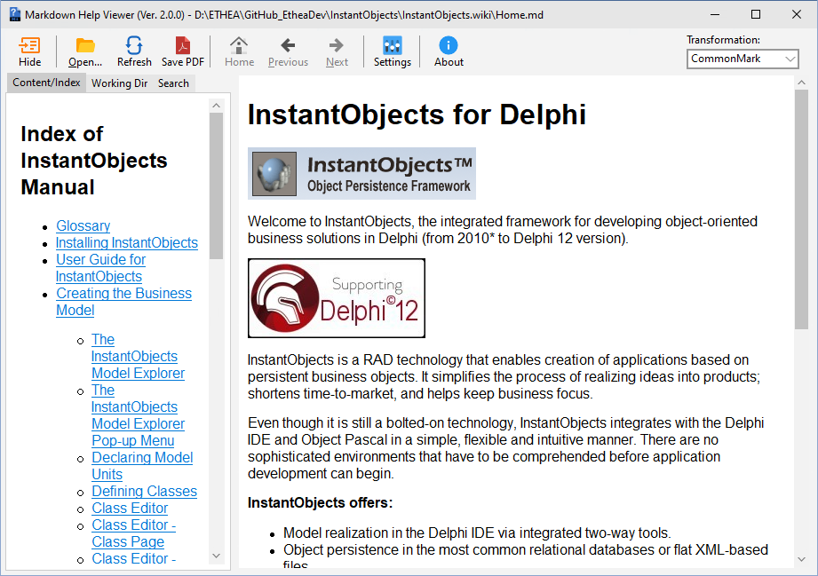

# Markdown Processor [](https://opensource.org/licenses/Apache-2.0)

A Markdown Processor Library for Delphi, to process/convert markdown files to HTML.

**Latest Version 1.0.1 - 2 Jan 2024**

============

Basic Information
-----------------

This is a Pascal (Delphi) library that processes markdown to HTML.
At present the following dialects of markdown are supported:

* The Daring Fireball dialect
 (see <https://daringfireball.net/projects/markdown/>)
* Almost complete support for CommonMark dialect
 (translated from <http://commonmark.org/>)
* Enhanced TxtMark dialect
 (translated from <https://github.com/rjeschke/txtmark>)


Using the Library with Delphi
-----------------------------

Declare a variable of the class TMarkdownProcessor:

```Pascal
     var
       md : TMarkdownProcessor;
```

Create a TMarkdownProcessor (MarkdownProcessor.pas) of the dialect you want:

```Pascal
       md := TMarkdownProcessor.createDialect(mdDaringFireball)
```
  
Decide whether you want to allow active content

```Pascal
       md.AllowUnSafe := true;
```
  
Note: you should only set this to true if you *need* to - active content can be a significant safety/security issue.  
 
Generate HTML fragments from Markdown content:

```Pascal
       html := md.process(markdown); 
```
  
Note that the HTML returned is an HTML fragment, not a full HTML page.  
  
Do not forget to dispose of the object after the use:

```Pascal
       md.free
```

Large rework was made for adding support for tables, math formulas, etc.

Examples
--------

this library is used in two projects:

- [MarkdownShellExtensions](https://github.com/EtheaDev/MarkdownShellExtensions)

A collection of tools for markdown files, to edit and view content, with an advanced Editor:


- [MarkdownHelpViewer](https://github.com/EtheaDev/MarkdownHelpViewer)

An integrated help system based on files in Markdown format (and also html), for Delphi applications:



## Release Notes ##

2 Jan 2024: ver. 1.0.1
- Updated Copyright

22 Oct 2023: ver. 1.0.0
- Project forked from FPC-markdown by Miguel A. Risco-Castillo
- Removed unused Dialect mdAsciiDoc
- changed position of enumerated dialect mdCommonMark for backward compatibility with Delphi-Markdown

## License

Copyright (c) Ethea S.r.l.

Licensed under the Apache License, Version 2.0 (the "License");

you may not use this file except in compliance with the License.

You may obtain a copy of the License at

<http://www.apache.org/licenses/LICENSE-2.0>

Unless required by applicable law or agreed to in writing, software distributed under the License is distributed on an "AS IS" BASIS, WITHOUT WARRANTIES OR CONDITIONS OF ANY KIND, either express or implied. See the License for the specific language governing permissions and limitations under the License.

## Contributors

MarkdownProcessor implementation is a fork of FPC-markdown by **Miguel A. Risco-Castillo**
[FPC-markdown](https://github.com/mriscoc/fpc-markdown)

FPC-markdown implementation is a fork of **Grahame Grieve** pascal port
[Delphi-markdown](https://github.com/grahamegrieve/delphi-markdown)

